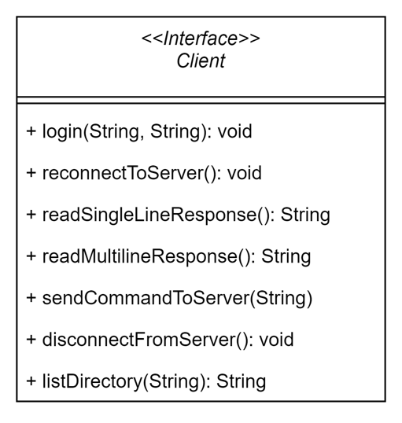

# Tree FTP Application

## Introduction

The aim of this project is to develop an application capable of connecting to an FTP server and retrieving the directory listing of that server in a similar way to the Linux tree command. It allows rendering of the tree in both [depth first search](https://en.wikipedia.org/wiki/Depth-first_search) and [breadth first search](https://en.wikipedia.org/wiki/Breadth-first_search) format, as well as generating a JSON file of the tree structure.

The user is able to set the username and password for logging in, the maximum depth of the tree to retrieve, the tree format to output (DFS/BFS), and finally a json flag to output the directory structure in JSON format. The program also supports a "--help" flag that helps the user understand how to use it.

## Compilation and running

To compile the program, make sure to have maven installed on the machine. Please run `mvn package` in the directory containing the src folder and the pom.xml file. This will compile the program and run all the tests.

To run the program, a jar executable is provided with the application. Simply go to the directory of that file and run the following command:
`java -jar tree-ftp-1.0-SNAPSHOT.jar [server] [username] [password] [max-depth] [dfs/bfs] [--json]`

For example, you can use this command to display the tree in DFS form and save it in a JSON file:
`java -jar tree-ftp-1.0-SNAPSHOT.jar ftp.ubuntu.com anonymous anonymous@examle.com 2 dfs --json`

Or, you can run the application by running the following command:
`mvn exec:java -Dexec.args="ftp.ubuntu.com anonymous anonymous@examle.com 2 dfs --json"`

***If you would like to get help on how to use the application simply run the following command: 
`java -jar tree-ftp-1.0-SNAPSHOT.jar --help`. It will provide information about each argument and option.***

## Architecture

This project constitutes of 1 interface "Client", and 3 classes, namely the "Main" class which is the driver of the application, the "FTPClient" class which contains the necessary method implementations of the client, and the class "TreeNode" which helps in creating the tree structure of the directroy that will be added to the JSON file.

### Client Interface
The UML diagram of the interface is as follows:

The `Client` interface defines the contract for an FTP client that interacts with an FTP server. It encapsulates all the necessary functionalities to interact with an FTP server.

The methods of this interface are the following:
- `login`: shall provide functionality to login into the server with the specified username and poassword.
- `reconnectToServer`: shall provide functionality to attempt reconnecting to the server in case the client became temporarily disconnected.
- `readSingleLineResponse`: shall provide functionality to read responses that contain only one line from the server.
- `readMultilineResponse`: shall provide functionality to read responses that are formed of several lines from the server.
- `sendCommandToServer`: shall provide functionality to send commands to the server.
- `disconnectFromServer`: shall provide functionality to disconnect the client and the server.
- `listDirectory`: this method shall be able to retrieve the components of a directory on the server.

***Please note that the details of the interface and the methods are added as javadoc in the `Client.java` interface file.***

### ClientFTP Class
The UML diagram of the class is as follows:

This class defines a client that connects to an FTP server and retrieves the directory listing in either a BFS or DFS manner. It implements the `Client` interface and develops its methods. This class also contains methods that allow the user to generate a JSON document of the tree directory.

***Please note that the details of the class and the methods are added as javadoc in the `FTPClient.java` file.***

### TreeNode Class

The UML diagram of the class is as follows:

This class represents a node in a tree defined by its name and a list of its children. The purpose of this class is to help in manipulating the hierarchical structure of directory contents and thereafter serialize it to JSON. This class is used by the `FTPClient` class when transforming the directory to a JSON file.

***Please note that the details of the class and the methods are added as javadoc in the `TreeNode.java` file.***